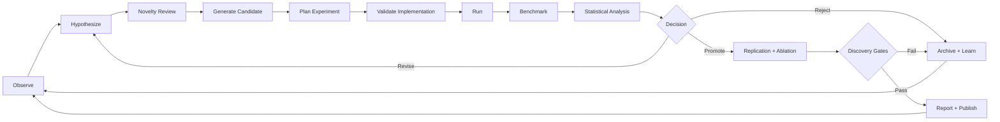
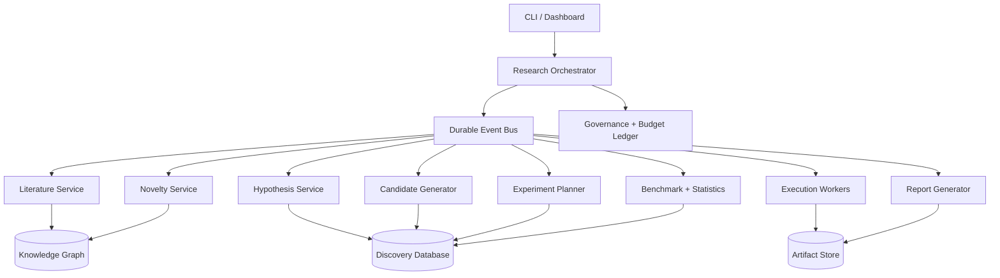

# AlgoLab v1 Master Specification

**Status:** Canonical v1 design  
**Mission:** Maximize validated AI-algorithm discoveries per unit compute, time,
and human oversight.

## 1. Scope

AlgoLab is a research automation system. It coordinates literature retrieval,
hypothesis generation, novelty estimation, candidate construction, experiment
planning, implementation, execution, evaluation, statistical analysis,
lineage tracking, and research reporting.

The system is successful when it produces reproducible evidence. A negative
result is useful if it is well designed, correctly executed, and updates future
search decisions.

AlgoLab v1 targets small and medium experiments that can be run on local CPU,
a single rented GPU, or a small Ray cluster. It must not assume frontier-scale
training access.

## 2. System objective

Primary objective:

`DiscoveryRate = ValidatedDiscoveries / TotalComputeCredits`

Secondary objectives:

- maximize information gained per experiment;
- minimize duplicate or poorly controlled experiments;
- maintain reproducibility above 95%;
- maintain budget estimation error below 25%;
- preserve complete hypothesis-to-result provenance;
- produce reports whose claims are directly linked to evidence.

One compute credit is defined as one A100-80GB equivalent GPU-hour. CPU and
other accelerators use configurable normalization factors. Monetary limits
override compute-credit limits.

## 3. Canonical entities

### Hypothesis
A falsifiable statement containing:
- mechanism;
- predicted measurable effect;
- target population/tasks;
- independent and dependent variables;
- baseline;
- confounders;
- disconfirmation criteria;
- estimated novelty;
- estimated cost and value of information.

### Candidate
A versioned algorithm, architecture, objective, optimizer, inference strategy,
data strategy, or composition of these. Every candidate has a machine-readable
manifest and explicit lineage.

### Experiment
A controlled comparison designed to evaluate one or more hypotheses. An
experiment contains one or more runs and has a fixed approved budget.

### Run
One execution with pinned code, data, environment, seed, configuration, and
hardware metadata.

### Result
The structured output of a run: metrics, logs, artifacts, status, anomalies,
and provenance.

### Discovery
A candidate-supported claim that passes improvement, statistical,
reproducibility, attribution, novelty, and governance gates.

## 4. Discovery gates

A result may be labeled a discovery only when all mandatory gates pass:

1. **Baseline gate:** comparison against an appropriate, reproduced baseline.
2. **Effect gate:** practically meaningful improvement or efficiency gain.
3. **Statistical gate:** uncertainty quantified; correction for repeated search.
4. **Replication gate:** repeated seeds and an independent confirmation run.
5. **Attribution gate:** ablations identify the component responsible.
6. **Compute gate:** gain is not merely caused by materially higher compute.
7. **Novelty gate:** literature and internal-history review performed.
8. **Integrity gate:** complete provenance and no unresolved data leakage.
9. **Governance gate:** no policy, budget, credential, or publishing violation.

Suggested v1 thresholds:
- at least 3 seeds for screening and 5 for promotion;
- 95% bootstrap confidence interval;
- Benjamini-Hochberg correction across simultaneous candidate tests;
- at least 1% relative improvement, or 20% efficiency improvement at parity;
- confirmation run from a clean checkout and fresh environment.

These defaults are configurable but changes require recorded justification.

## 5. Research lifecycle

Lifecycle states:

`DRAFT -> VETTING -> PLANNED -> APPROVED -> IMPLEMENTING -> VALIDATING ->
RUNNING -> ANALYZING -> REJECTED | REVISED | REPLICATING -> DISCOVERY | ARCHIVED`

Every transition emits an immutable event.

## 6. Architecture

AlgoLab uses a control plane, research services, execution workers, and
persistent stores.

Recommended v1 implementation:
- Python 3.11+
- Pydantic models for all contracts
- FastAPI control plane
- PostgreSQL or SQLite for initial development
- local filesystem artifact store, S3-compatible later
- Redis Streams or database-backed queue
- PyTorch for experiments
- Ray optional, introduced after single-worker correctness
- Docker for reproducibility
- pytest, ruff, mypy, pre-commit
- MLflow-compatible experiment records or native equivalent

## 7. Agent model

Agents are bounded services, not unrestricted personas. Each receives typed
inputs, produces typed outputs, and cannot directly promote its own work.

Required roles:
- Research Director: chooses objectives and allocates exploration budget.
- Literature Analyst: retrieves and structures prior art.
- Hypothesis Scientist: produces falsifiable hypotheses.
- Skeptical Reviewer: attempts to reject hypotheses before compute is spent.
- Novelty Analyst: estimates overlap with known work.
- Candidate Designer: creates manifests for candidate changes.
- Experiment Designer: builds controlled experiments and power estimates.
- Implementation Engineer: implements only approved manifests.
- Verification Engineer: tests correctness and leakage risks.
- Benchmark Operator: runs pinned evaluations.
- Statistician: analyzes results and corrects for repeated search.
- Replication Reviewer: performs clean reruns.
- Archivist: records lineage, failures, and decisions.
- Governance Controller: enforces budget and action permissions.

Separation of duties:
- candidate designers cannot score final novelty;
- implementers cannot approve their own experiments;
- the statistician cannot alter raw results;
- report generation cannot invent missing evidence;
- self-improvement proposals require a shadow evaluation.

## 8. Candidate search space

AlgoLab may search:
- architectural components;
- attention and recurrence mechanisms;
- memory and retrieval systems;
- routing and mixture-of-experts policies;
- optimizers and update rules;
- learning-rate and curriculum schedules;
- training objectives and regularizers;
- synthetic-data selection;
- inference-time search and verification;
- compression, distillation, quantization, and caching;
- tool-routing and planning policies.

AlgoLab v1 must begin with constrained, typed transformations. Free-form model
rewrites are permitted only after deterministic validation exists.

Candidate manifests must describe:
- parent candidates;
- changed components;
- expected mechanism;
- parameter and FLOP delta;
- compatibility requirements;
- failure predictions;
- minimum experiment needed to falsify the hypothesis.

## 9. Experiment planning

The planner ranks experiments by:

`Priority = P(success) * EstimatedValue * InformationGain / ExpectedCost`

It must reserve budget for:
- baselines;
- replications;
- debugging overhead;
- ablations;
- negative-result verification.

No experiment may start without:
- an approved manifest;
- a baseline;
- success and failure thresholds;
- seed plan;
- maximum runtime;
- maximum cost;
- artifact retention plan;
- cancellation conditions.

Use staged evaluation:
1. static validation;
2. unit test;
3. tiny-data smoke test;
4. low-fidelity screen;
5. medium-fidelity confirmation;
6. replication and ablation.

## 10. Benchmarking

Benchmark suites must:
- include correctness, capability, efficiency, robustness, and calibration;
- pin versions and datasets;
- isolate train, validation, and test data;
- record contamination risk;
- provide baseline reproduction scripts;
- produce machine-readable metrics;
- disallow selective metric omission.

A candidate may be Pareto-improving even without a raw-score gain when it
achieves equivalent quality with lower latency, memory, energy, or compute.

## 11. Statistical protocol

Required outputs:
- point estimate;
- confidence interval;
- effect size;
- seed-level measurements;
- corrected significance value;
- power or sensitivity analysis;
- robustness checks;
- predeclared primary metric;
- all tested candidates, including failed ones.

Adaptive search creates multiple-comparison risk. The laboratory must maintain
a search ledger and apply false-discovery-rate control. Promising results are
not discoveries until confirmed on held-out runs that did not influence the
search.

## 12. Storage and provenance

Every entity has:
- stable ID;
- schema version;
- creation time;
- creator/service;
- parent IDs;
- code commit;
- config hash;
- dataset hash;
- environment digest;
- event history.

Canonical ID prefixes:
- `HYP-`
- `CAND-`
- `EXP-`
- `RUN-`
- `RES-`
- `DISC-`
- `REP-`
- `EVT-`

Raw results are append-only. Corrections create new records linked to the
superseded record.

## 13. Self-improvement

AlgoLab may propose changes to:
- prompts;
- ranking weights;
- search operators;
- experiment templates;
- scheduling policies;
- retrieval methods.

It may not silently apply them.

Every meta-change follows:
1. versioned proposal;
2. expected benefit and risk;
3. replay on historical tasks;
4. shadow deployment;
5. A/B comparison;
6. governance approval;
7. reversible rollout;
8. post-deployment audit.

The system must never optimize by weakening benchmarks, hiding failures, or
changing discovery thresholds without explicit approval.

## 14. Governance

Autonomy levels:
- **L0:** recommendations only.
- **L1:** local file changes and low-cost experiments within sandbox.
- **L2:** scheduled experiments under approved budget.
- **L3:** external publication, credential use, or distributed scale; always
  requires explicit human approval in v1.

Hard controls:
- daily and total budget caps;
- allowed command and network policies;
- secrets accessed only through named adapters;
- immutable audit log;
- emergency stop;
- maximum autonomous iteration count;
- no recursive process spawning without limits;
- no unauthorized repository pushes or public releases.

## 15. Failure policy

Expected failures include:
- benchmark overfitting;
- data leakage;
- invalid baselines;
- silent implementation bugs;
- novelty false positives;
- compute-estimation drift;
- agent collusion or shared blind spots;
- endless low-value exploration;
- corrupted artifacts;
- unreproducible gains;
- reward hacking;
- runaway spending.

Every failure receives:
- severity;
- detection signal;
- containment action;
- root-cause record;
- prevention test.

A failed run must never be automatically retried indefinitely.

## 16. v1 acceptance criteria

AlgoLab v1 is complete only when it can:

1. ingest a small curated literature set;
2. represent hypotheses, candidates, experiments, runs, and results;
3. reproduce at least two known baseline methods;
4. generate a bounded candidate mutation;
5. plan and execute a controlled toy experiment;
6. compare the candidate against a baseline across seeds;
7. produce statistical and compute-normalized analysis;
8. reject an invalid candidate correctly;
9. create a complete provenance bundle;
10. generate a draft report containing no unsupported claims;
11. stop at the configured compute or monetary limit;
12. recover cleanly from an interrupted run.

The first demonstration should rediscover a known improvement on a small task,
such as optimizer choice, activation choice, regularization, or schedule.

## 17. Delivery phases

- **Phase 0 — Contracts:** schemas, state machine, storage, test strategy.
- **Phase 1 — Deterministic core:** orchestration without LLM agents.
- **Phase 2 — Toy rediscovery:** known methods on small datasets.
- **Phase 3 — Assisted ideation:** LLM hypotheses with strict validation.
- **Phase 4 — Evolutionary search:** typed mutations and Pareto selection.
- **Phase 5 — Distributed execution:** Ray or queue-backed workers.
- **Phase 6 — Controlled self-improvement:** shadow-tested meta changes.
- **Phase 7 — Research release:** reproducible benchmark and paper artifact.

No phase begins until the previous phase's acceptance tests pass.
