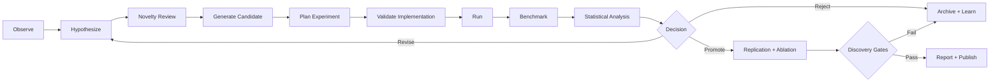

# AlgoLab — Autonomous AI Algorithm Discovery Laboratory

> **A bounded, reproducible research platform for proposing, implementing,
> testing, rejecting, refining, and reporting candidate improvements to AI
> systems.**

AlgoLab's objective is **not** to "invent AGI on command." Its objective is to
maximize the rate of **valid, reproducible algorithmic discoveries per unit of
compute and human oversight** — a disciplined discovery engine, not a
singularity machine.

[](LICENSE)
[](implementation/algolab/pyproject.toml)
[](implementation/algolab/M0_COMPLETION_REPORT.md)
[](implementation/algolab/.github/workflows/ci.yml)

## What is this repository?

This is the **canonical engineering specification** of AlgoLab v1, plus its
**implemented foundation** (Milestone M0). It is designed to be executed by an
autonomous coding agent (e.g., OpenCode) module by module — interfaces, data
schemas, algorithms, pseudocode, failure modes, acceptance tests, and
milestones are all specified.

```
┌─────────────────────────────────────────────────────────────┐
│  README.md  ← you are here (landing page)                   │
│  MASTER_SPEC.md          canonical v1 design (the source of truth) │
│  OPENCODE_KICKOFF_PROMPT.md   prompt used to start M0        │
│  spec/                  charter, ontology, architecture,     │
│                         research method, search/evolution,   │
│                         experiment protocol, governance      │
│  schemas/               canonical JSON Schemas (hypothesis,  │
│                         candidate, experiment)               │
│  prompts/agents/        bounded agent role contracts         │
│  workflows/             reference rediscovery workflow (YAML)│
│  templates/             hypothesis template                  │
│  planning/              milestones (M0–M5)                   │
│  implementation/algolab  M0 code: contracts layer, CLI,      │
│                         tests, CI, ADRs                      │
└─────────────────────────────────────────────────────────────┘
```

## The research loop



## Non-negotiable constraints

- Fixed compute and monetary budgets — one compute credit = one A100-80GB GPU-hour.
- Reproducible runs and immutable provenance; append-only audit events.
- No benchmark result without a baseline.
- No discovery claim without replication and statistical support.
- No self-modification outside versioned, reviewable proposals.
- No uncontrolled external actions or credential use.
- Human approval before scaling compute, publishing, or changing governance.

## Get started

**Read the spec first:**

1. [`MASTER_SPEC.md`](MASTER_SPEC.md) — canonical v1 design.
2. [`OPENCODE_KICKOFF_PROMPT.md`](OPENCODE_KICKOFF_PROMPT.md) — the prompt that
   drives an autonomous coding agent through the milestones.
3. [`planning/MILESTONES.md`](planning/MILESTONES.md) — M0–M5 with acceptance
   criteria.

**Try the implemented foundation (M0):**

```bash
cd implementation/algolab
bash scripts/setup.sh        # venv + editable install
make lint && make type && make test   # 98 tests, ruff + mypy clean

algolab init-db --config configs/algolab.yaml
algolab validate-manifest --type hypothesis --file hyp.json
algolab budget-state --config configs/algolab.yaml
```

See [`implementation/algolab/README.md`](implementation/algolab/README.md) and
[`implementation/algolab/M0_COMPLETION_REPORT.md`](implementation/algolab/M0_COMPLETION_REPORT.md)
for details.

## Roadmap

| Milestone | Scope | Status |
|---|---|---|
| **M0** | Repository and contracts — IDs, models, state machines, append-only event store, budget ledger, schema validation, CLI, CI | ✅ Complete |
| M1 | Deterministic execution core — approve/schedule/cancel/restart local runs, provenance bundles | ⏳ Next |
| M2 | Reference rediscovery — reproduce a known improvement (e.g., optimizer/activation) across 5 seeds | — |
| M3 | LLM-assisted research — model adapter, structured hypotheses, skeptical review | — |
| M4 | Evolutionary search — typed mutations, Pareto archive, diversity control | — |
| M5 | Controlled meta-improvement — versioned, shadow-tested self-improvement | — |

## Design principles (top of the list)

1. **Discovery rate is the objective; breakthroughs are asymptotes.**
2. **The fixed compute budget is the primary currency and a hard constraint.**
3. **Reproducibility is a hard gate, not a preference.**
4. **Hypothesis-driven search beats shuffling knobs.**
5. **Statistical rigor gates every claim.**
6. **Lineage and provenance are mandatory, free-form memory is not.**
7. **Human oversight by default, autonomy by exception.**

## Realistic expectations

AlgoLab will generate and test many ideas, **rediscover known techniques**,
combine existing ideas in novel ways, find engineering improvements, and
occasionally uncover genuinely interesting new approaches. Fundamentally new
paradigms are rare; the value of the system is that it dramatically increases
the rate at which hypotheses are generated and evaluated.

## License

MIT — see [LICENSE](LICENSE).
