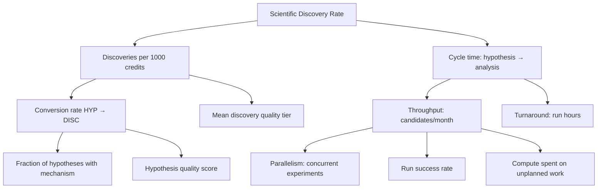

# 02 RESEARCH MISSION

- **Status:** v1.0 — Complete specification
- **Purpose:** Defines the mission statement, success criteria, discovery taxonomy, KPIs, scope boundaries, and non-goals for AlgoLaB.
- **Cross-references:** `00_EXECUTIVE_SUMMARY.md`, `01_DESIGN_PRINCIPLES.md`, `03_SYSTEM_ARCHITECTURE.md`, `12_EXPERIMENT_PLANNER.md`, `15_STATISTICAL_ANALYSIS.md`, `16_DISCOVERY_DATABASE.md`

---

## 1. Mission Statement

> **AlgoLaB maximizes the scientific discovery rate in AI algorithm research
> by iteratively proposing, implementing, benchmarking, analyzing, and
> evolving candidate algorithms under a fixed compute budget.**

The lab is a *research instrument*, not a research team. It succeeds when the
**rate of validated, reproducible, attributed improvements to machine-learning
algorithms** — normalized by compute spent — is maximized over time.

## 2. Success Criteria (top level)

AlgoLaB is a success if, within 12 months of M0 (see `22_ROADMAP.md`), it
demonstrates:

1. **Throughput:** ≥ 100 hypothesis-tested candidates per month at steady
   state.
2. **Capability ladder:** Re-discovers ≥ 25% of a held-out set of known
   methods (e.g., AdamW, GELU, EMA, weight decay, warmup schedules) purely
   from its own pipeline (see §6).
3. **Validity:** Zero *unreproduced* discovery claims — every declared
   discovery must pass §5 gates, enforced by SA (`15`) and audited by GV
   (`19`).
4. **Efficiency:** ≥ 1 discovery per 1,000 compute credits (steady state).
5. **Autonomy ladder:** Progress through governance autonomy levels L0→L2
   (`19` §7) with no audit failures.

## 3. KPI Tree



KPI definitions, owners, and review cadence live in `16_DISCOVERY_DATABASE.md`
§9 and `18_SELF_IMPROVEMENT.md` §5.

## 4. Objective Function (normative)

The lab maintains an explicit **utility score** used by the planner (`12`) and
the evolutionary search (`11`) to prioritize work. It is *not* the only
decision criterion, but it is the canonical one.

```
U(candidate) = EIG(candidate) / cost(candidate) + λ_diversity × novelty(candidate)
```

Where:

- `EIG` = expected information gain (defined in `12` §6.2; Bayesian update on
  the lab's hypothesis priors from the predicted run outcome distribution).
- `cost` = estimated compute credits (`12` §5).
- `novelty` = normalized [0,1] from NE (`08` §4).
- `λ_diversity` = configurable exploration weight (default 0.1; tuned by `18`).

## 5. Discovery Taxonomy (normative)

A **Discovery** is a candidate that passes every gate below. Gate details:
`15_STATISTICAL_ANALYSIS.md` §6, `19_GOVERNANCE.md` §4.

### 5.1 Discovery Tiers

| Tier | Name | Primary Gate | Examples |
|---|---|---|---|
| **A** | Major discovery | ≥ 5% relative improvement over best baseline on ≥ 1 primary benchmark **or** ≥ 1% on ≥ 3 primary benchmarks; all other gates pass | New attention mechanism beating all baselines; new optimizer with wall-clock win |
| **B** | Minor discovery | ≥ 1% relative improvement over best baseline on ≥ 1 primary benchmark; all other gates pass | Targeted improvement of an existing component |
| **C** | Engineering discovery | No score gain, but ≥ 30% reduction in compute, latency, or memory at parity accuracy; or a correctness/reproducibility fix validated by regression suite | Kernel fusion, sparse routing that preserves accuracy |

Tier assignments are recorded at declaration time (`16` §8, table
`discoveries`).

### 5.2 The Six Gates (normative)

| # | Gate | Criterion | Owner | Fails →
|---|---|---|---|---|
| G1 | Improvement | Per §5.1 tier thresholds, relative to best *reproduced* baseline | SA (`15`) | Rejected |
| G2 | Significance | p < 0.05 after multiple-comparison correction (Benjamini–Hochberg), ≥ 3 seeds, bootstrap 95% CI of the gain excludes 0 | SA | Rejected |
| G3 | Compute fairness | compute-normalized gain ≥ 80% of raw gain (gain per credit vs. baseline per credit) | SA | Demoted to Tier C or rejected |
| G4 | Reproducibility | Re-run from config hash alone reproduces effect (within CI overlap) | TP+SA | Suspended until reproduced |
| G5 | Attribution | Ablations explain ≥ 50% of the gain (gain attributable to the introduced mechanism) | SA+NE | Demoted with partial credit |
| G6 | Safety/governance | Passes risk review, bias check, no gate violations | GV (`19`) | Blocked |

### 5.3 Negative Results

A candidate that fails G1/G2 but was *hypothesis-driven, well-powered, and
cleanly run* is recorded as a **Negative Result** (`16` §8) and is a valuable
KG edge (hypothesis → falsified). Negative results feed prior updates
(`07` §6) and paper negatives sections (`17` §4).

## 6. Capability Ladder (rediscovery scoring)

Rediscovery is a *feature*. The lab is scored on its ability to rediscover a
held-out **Canonical Known-Method Set (CKMS)**:

| Level | Ability | Evidence | Gate |
|---|---|---|---|
| L0 | No capabilities | — | Bootstrap |
| L1 | Single-component rediscovery | AdamW, GELU, EMA, cosine schedule | ≥ 1 in M1 |
| L2 | Component recombination | + weight decay tuning, + warmup, + learning-rate sweep | ≥ 3 distinct |
| L3 | Structural rediscovery | Attention alternatives, normalization variants | ≥ 5 total |
| L4 | Novel combination | A discovered combination not in CKMS but validated by G1–G6 | M3+ |

Scoring: `rediscovery_rate = |rediscovered ∩ CKMS| / |CKMS|`. This KPI is
tracked in `16` §9 and reviewed monthly (`18`).

## 7. Scope Boundaries

### 7.1 In-scope search spaces (see `09` §3 for catalog)

- Architectures: attention, recurrence, memory, routing, MoE, latent
  reasoning, normalization, position encodings, activations.
- Optimizers and learning-rate schedules.
- Training objectives and loss functions.
- Memory systems (external memory, caches, KV compression).
- Inference-time algorithms (decoding, speculative, retrieval).
- Data generation strategies (augmentation, curriculum, synthetic data).

### 7.2 Out-of-scope (hard boundaries)

1. **No frontier-scale training.** Maximum single-run budget is governed by
   `12` §7 (default 200 credits) unless escalated and human-approved.
2. **No deployment beyond research sandboxes** without DEP release (`20`).
3. **No training on non-redistributable data** (`19` §5).
4. **No attempts to circumvent the budget ledger or governance gates** under
   any circumstance (`21-FM-0601`).
5. **No evaluation gaming**: benchmark data leakage checks are mandatory
   (`14` §7).
6. **No agent-written code executed without verification** — every scaffolded
   training script passes TP verification (`13` §3) before any credits are
   spent.

### 7.3 Compute budget envelope

- Default: **100 credits/week**, **5,000 credits lifetime cap** (both
  configurable in `lab.yaml`).
- The ledger is authoritative; overruns freeze planning (`12` §8).

## 8. Autonomy Levels (summary)

Defined fully in `19` §7:

| Level | Human gates | Description |
|---|---|---|
| L0 | Everything | Human approves each experiment plan |
| L1 | Budget + discovery + paper | Autonomous within credit envelope; human reviews discoveries and papers |
| L2 | Kill switch only | Full autonomy for in-scope research; standing review |
| L3 | — | Not in scope (permanent kill switch retained regardless) |

## 9. Governance of the Mission

- Mission changes (scope, KPIs, budget envelope) require a **mission amendment**
  recorded in `19` §9.3.
- The mission is reviewed quarterly; KPI attainment is published in the
  quarterly report (`17` §5).

## 10. Acceptance Tests

| ID | Test | Pass condition |
|---|---|---|
| AT-M1 | KPI telemetry exists | DDB exposes KPI views (`16` §9) with non-empty data for ≥ 1 loop |
| AT-M2 | CKMS run | Held-out set defined; M1 rediscovery recorded |
| AT-M3 | Gate suite | Fake discovery candidate fails G2; fake negative passes all gates as negative |
| AT-M4 | Budget envelope | Planner refuses schedule when ledger insufficient |
