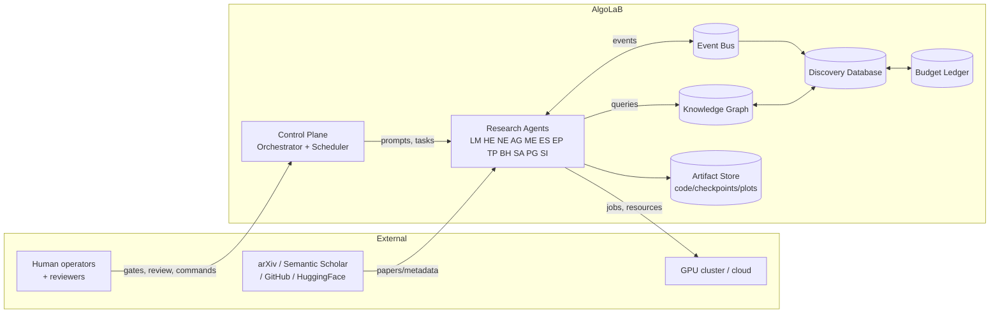
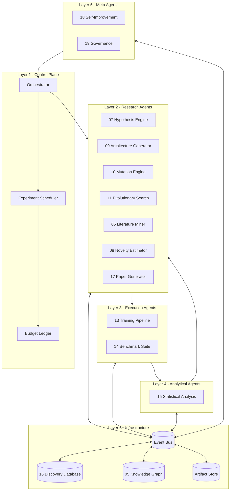
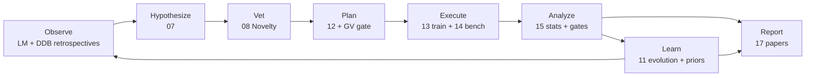
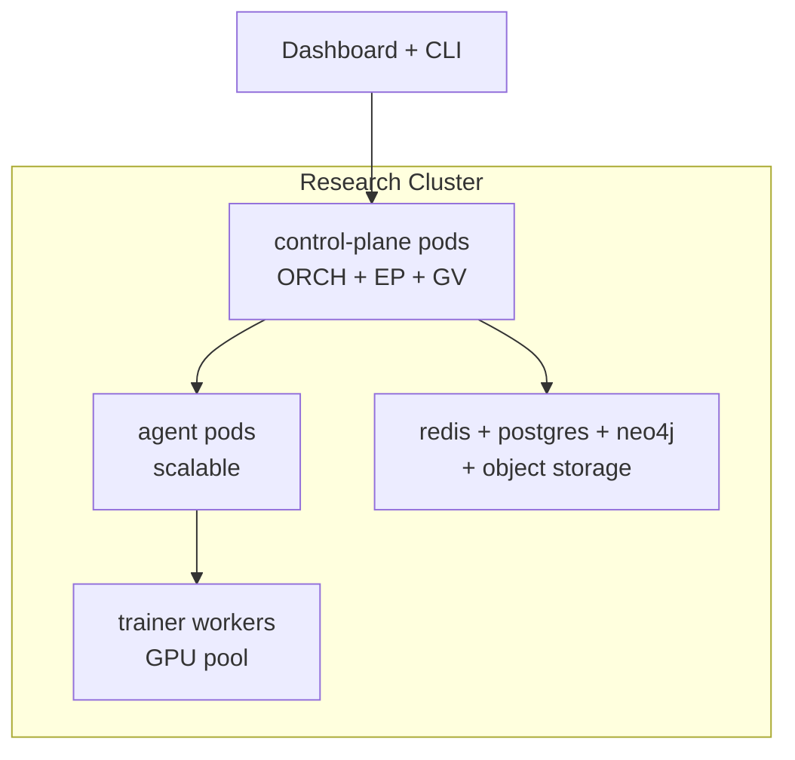

# 03 SYSTEM ARCHITECTURE

- **Status:** v1.0 — Complete specification
- **Purpose:** Defines the overall system architecture of AlgoLaB: layers, modules, event bus, control flow, data flow, deployment topology, technology stack, repository layout, configuration standard, and normative interfaces.
- **Cross-references:** `04_AGENT_HIERARCHY.md`, `05_KNOWLEDGE_GRAPH.md`, `12_EXPERIMENT_PLANNER.md`, `16_DISCOVERY_DATABASE.md`, `20_DEPLOYMENT.md`, `21_FAILURE_MODES.md`

---

## 1. Architectural Goals

1. **Modularity**: 23 modules, each independently implementable and testable.
2. **Resilience**: no single module failure halts the loop (P12).
3. **Auditability**: every action is an event; every event is logged (P9).
4. **Determinism**: the control plane is deterministic; stochasticity is confined to sanctioned generators (P7, P3).
5. **Resource honesty**: compute credits are the only currency; the ledger is never overrun (P2).

## 2. Context Diagram



## 3. Module Map

| Module | Doc | Role | Produces |
|---|---|---|---|
| Literature Miner | `06` | Ingest papers, repos, benchmarks | KG nodes/edges |
| Hypothesis Engine | `07` | Propose falsifiable hypotheses | Hypotheses |
| Novelty Estimator | `08` | Score novelty vs. corpus+KG | Novelty score |
| Architecture Generator | `09` | Build candidate architectures | Candidate manifests |
| Mutation Engine | `10` | Mutate/recombine candidates | Mutated candidates |
| Evolutionary Search | `11` | Select, prune, evolve population | Population decisions |
| Experiment Planner | `12` | Price, prioritize, schedule | Experiment plans |
| Training Pipeline | `13` | Verify, run, checkpoint training | Trained models |
| Benchmark Suite | `14` | Evaluate against baselines | Benchmark results |
| Statistical Analysis | `15` | Gate results, write run reports | Run reports, discoveries |
| Knowledge Graph | `05` | Semantic store of methods | — |
| Discovery Database | `16` | Relational/event store, ledger | — |
| Paper Generator | `17` | Assemble papers from evidence | Papers |
| Self-Improvement | `18` | Tune the lab's own strategy | Meta-configs |
| Governance | `19` | Gates, audits, kill switch | Approvals, audits |
| Deployment | `20` | Operate, monitor, secure | Running system |

## 4. Layered Architecture



**Control rules:**
- Only the Orchestrator dispatches research-loop steps.
- Agents never write to the DDB directly; they publish events, and the DDB's
  projection layer (or the orchestrator's handlers) persists state.
- Agents may read (query) DDB/KG freely.
- Governance gates are evaluated *before* scheduling and *before* any
  declaration/paper action.

## 5. The Event Bus

- **Transport:** Redis Streams (or Kafka) with durable consumer groups.
- **Contract:** every event is a JSON envelope (schema below); every event is
  retained in the DDB `events` table (`16` §8).
- **Ordering:** per-partition ordering by `(trace_id)` for loop-critical topics;
  best-effort for analytics topics.
- **Retention:** 90 days in the broker; permanent in DDB.

### 5.1 Event Envelope (normative)

```json
{
  "event_id": "EVT-0a1b2c3d",
  "type": "lab.run.completed",
  "version": "1",
  "ts": "2026-08-03T12:34:56Z",
  "producer": "TP",
  "trace_id": "TRC-9f8e7d6c",
  "subject": "RUN-1a2b3c4d",
  "data": {}
}
```

### 5.2 Canonical Topic Registry

| Topic | Producer → Consumer | Purpose |
|---|---|---|
| `lab.hypothesis.created` | HE → NE, DDB | New hypothesis |
| `lab.candidate.created` | AG/ME/ES → NE, DDB | New candidate manifest |
| `lab.novelty.estimated` | NE → EP, DDB | Novelty score attached |
| `lab.experiment.planned` | EP → GV, ORCH | Plan awaiting approval |
| `lab.experiment.approved` | GV → EP | Plan approved |
| `lab.run.started` | TP → DDB | Run begins; ledger charge |
| `lab.run.completed` | TP → SA | Raw metrics ready |
| `lab.run.failed` | TP → SA, ORCH | Failure event (FM code) |
| `lab.experiment.completed` | SA → ES, DDB | All runs analyzed |
| `lab.discovery.declared` | SA → GV, PG | Candidate passes gates |
| `lab.kg.updated` | LM → all | KG grew |
| `lab.budget.exhausted` | BUD → ORCH | Planner freezes |
| `lab.governance.blocked` | GV → ORCH | Gate violation |
| `lab.paper.published` | PG → DDB | Paper release |
| `lab.meta.applied` | SI → ORCH | Strategy config changed |

## 6. The Research Loop (canonical control flow)



**Loop invariants:**
1. A candidate must pass novelty vetting before it can be planned.
2. A plan must be approved by GV (at the current autonomy level) before
   execution.
3. A run may only start when the ledger shows sufficient unreserved credits.
4. No discovery declaration without SA gate verdicts G1–G5.
5. The loop may stop (exhaustion/stagnation) and be restarted from the last
   checkpointed event offset.

## 7. Orchestrator Behavior

The Orchestrator (ORCH) is a single process with a state machine over loop
stages. It:

1. Consumes events; advances loop stage per the transition table below.
2. Maintains the **work queue** (candidates awaiting vetting/planning).
3. Coordinates with EP for scheduling; never schedules itself.
4. Emits `lab.*` control events; publishes periodic heartbeat
   (`lab.orchestrator.heartbeat`, 30 s) for liveness monitoring.

### 7.1 Candidate Lifecycle (normative state machine)

```
DRAFT -> VETTING -> PLANNED -> READY -> RUNNING -> ANALYZED -> ACCEPTED|REJECTED|ARCHIVED
                                                        ACCEPTED -> DISCOVERY
```

| Transition | Trigger event | Owner |
|---|---|---|
| DRAFT → VETTING | `lab.candidate.created` | ORCH |
| VETTING → PLANNED | `lab.novelty.estimated` (score ≥ vet threshold) | NE+ORCH |
| VETTING → ARCHIVED | novelty below threshold | NE+ORCH |
| PLANNED → READY | `lab.experiment.approved` + scaffold verified | EP+TP |
| READY → RUNNING | ledger reservation confirmed | TP |
| RUNNING → ANALYZED | all runs completed + SA report | SA |
| ANALYZED → ACCEPTED | gates G1–G5 pass | SA |
| ANALYZED → REJECTED | gates fail | SA |
| ANALYZED → ARCHIVED | stagnation policy (60 d) | ES |
| ACCEPTED → DISCOVERY | GV review (G6) at autonomy level | GV |

## 8. Data Flow & Stores

| Store | Technology | Content | Owner doc |
|---|---|---|---|
| Discovery Database (DDB) | PostgreSQL 16 | candidates, hypotheses, experiments, runs, metrics, events, ledger | `16` |
| Knowledge Graph (KG) | Neo4j 5 | methods, concepts, relations, provenance | `05` |
| Artifact Store | object storage (S3-compatible) | code trees, configs, checkpoints, plots, papers | `13`/`17` |
| Vector Index | pgvector or FAISS | embeddings for novelty/search | `08` |
| Config Registry | git + YAML | lab.yaml + module configs | §10 |

## 9. Technology Stack (normative baseline)

| Concern | Choice | Notes |
|---|---|---|
| Language | Python 3.11+ | all modules; typed (PEP 604) |
| ML framework | PyTorch 2.x | candidates may specify framework but torch is default |
| Distributed jobs | Ray 2.x | workers, placement, autoscaling |
| Event bus | Redis Streams 7 (prod: Kafka) | durable, consumer groups |
| DDB | PostgreSQL 16 | via SQLAlchemy 2 / asyncpg |
| KG | Neo4j 5 | via official driver |
| Embeddings | local sentence-transformer (BGE-base) | no external API for science-critical embeddings |
| Control API | FastAPI + Pydantic v2 | schemas are normative |
| Config | YAML + Pydantic | single source of truth `lab.yaml` |
| CI/CD | GitHub Actions | `20` §5 |
| Container | Docker, K8s (research cluster) | `20` §3 |
| Observability | Prometheus + Grafana + structured logs | `20` §7 |

### 9.1 Module→Interface Mapping

Every module exposes:
- a **Python service class** (importable API),
- a **REST resource** under `/api/v1/<module>/` (thin control plane),
- **event emission** on its topic(s).

### 9.2 Compute Credit Model (normative)

- 1 **credit (CC)** = 1 GPU-hour on an A100-80GB equivalent.
- Normalization: `credits = gpu_hours × perf_factor`, where perf_factor for
  H100 = 1.5, V100 = 0.5, CPU-only training = 0.01 (configurable).
- All costs recorded with each run in `runs.credits_spent`.
- The **budget ledger** (`budget_ledger` table) is append-only: reservations,
  charges, refunds, and grants are separate ledger entries.

## 10. Repository Layout (normative for implementation)

```
algo-lab/
├── lab.yaml                     # global config (Pydantic-validated)
├── src/algo_lab/
│   ├── core/                    # ids, schemas, config, event bus client
│   ├── control/                 # orchestrator, scheduler, budget ledger
│   ├── agents/                  # per-agent controllers (04)
│   ├── modules/                 # LM HE NE AG ME ES EP TP BH SA PG SI
│   ├── storage/                 # DDB, KG, artifact store clients
│   └── ops/                     # observability, governance hooks
├── tests/                       # unit + integration + acceptance
├── ops/                         # docker, k8s manifests, CI workflows
├── data/                        # volumes: ddb, kg, artifacts, vectors
├── notebooks/                   # curated analysis notebooks
├── papers/                      # generated paper packages
└── docs/                        # this specification (mirrored)
```

## 11. Config Standard (`lab.yaml`)

```yaml
lab:
  name: algolab
  version: "1.0.0"
  environment: research
budget:
  weekly_credits: 100
  lifetime_cap_credits: 5000
  max_run_credits: 200
randomness:
  master_seed: 20260803
  llm:
    temperature: 0.8
    top_p: 0.95
governance:
  autonomy_level: L1
  gates:
    plan_auto_approve_max_credits: 20
orchestrator:
  heartbeat_seconds: 30
  loop_min_interval_minutes: 10
  workqueue_max_parallel_vetting: 8
```

Every module reads only its own config slice; unknown keys fail validation
(P10, strictness).

## 12. Normative Interfaces

### 12.1 DDB Client (interface; `16` §10)

```python
class DiscoveryDB:
    async def create_candidate(self, manifest: dict) -> Candidate: ...
    async def get_candidate(self, cid: str) -> Candidate: ...
    async def add_event(self, event: EventEnvelope) -> None: ...
    async def reserve_credits(self, plan_id: str, credits: float) -> Reservation: ...
    async def charge_run(self, run_id: str, credits: float) -> None: ...
    async def query_metrics(self, *, candidate_id: str = None,
                            benchmark: str = None, limit: int = 100) -> list[RunReport]: ...
```

### 12.2 KG Client (interface; `05` §7)

```python
class KnowledgeGraph:
    async def upsert_paper(self, paper: PaperRecord) -> None: ...
    async def add_method_edge(self, sub: str, rel: str, obj: str, **props) -> None: ...
    async def neighbors(self, node_id: str, rels: list[str] = None, depth: int = 1) -> list: ...
    async def similarity(self, embedding: list[float], k: int = 10) -> list[Neighbor]: ...
```

### 12.3 Planner Interface (interface; `12` §10)

```python
class ExperimentPlanner:
    async def estimate_cost(self, candidate: Candidate, plan: dict) -> float: ...
    async def score_plan(self, plan: dict) -> PlanScore: ...
    async def submit_plan(self, candidate_id: str, config: dict) -> ExperimentPlan: ...
    async def balance_ledger(self) -> LedgerSummary: ...
```

## 13. Deployment Topology (summary)

Full detail in `20_DEPLOYMENT.md` §3:



## 14. Failure Handling (summary)

Full catalogue in `21_FAILURE_MODES.md`. Architecture-level rules:

1. **At-least-once delivery** for all events; idempotent handlers by
   `event_id`.
2. **Dead letter queue** for poison events; DLQ alarm.
3. **Run-level retry**: operator errors retried ≤ 2 with corrected scaffold;
   infrastructure errors retried with backoff ≤ 3 (`21-FM-0201`).
4. **Orchestrator crash**: state is reconstructible from event log replay;
   lease-based leader election prevents split-brain.
5. **Budget freeze**: automatic on ledger exhaustion; human un-freeze only.

## 15. Acceptance Tests (architecture)

| ID | Test | Pass condition |
|---|---|---|
| AT-ARCH-1 | Event end-to-end | Emit `lab.candidate.created` from a test agent; observe the full lifecycle in DDB within 60 s |
| AT-ARCH-2 | Idempotency | Deliver same event twice → exactly one DDB write |
| AT-ARCH-3 | Kill orchestrator | Restart ORCH; loop resumes from last checkpointed offset without duplicate runs |
| AT-ARCH-4 | Ledger integrity | Concurrent reservations cannot overrun weekly credits (fuzz test with 50 parallel planners) |
| AT-ARCH-5 | Isolation | Stop KG; lab continues to run experiments; LM queues ingestion |
| AT-ARCH-6 | Config strictness | Invalid `lab.yaml` key → boot failure with clear message |

## 16. Implementation Notes

1. Build order per `22_ROADMAP.md`: core (ids, config, bus, DDB) → control →
   TP/BH (execution first, so everything can be tested) → HE/NE → AG/ME/ES →
   EP → SA → LM/KG → PG → SI.
2. Keep the event bus schema registry (`16` §8) as the single source of
   contract truth; module PRs must bump the registry version.
3. Use `trace_id` propagation from candidate creation through paper
   publication; it is the backbone of lineage (`16` §4).
4. All module service classes must be importable without side effects
   (pure construction) so unit tests can run headless.
5. Never embed prompt text in multiple modules: prompts live in the agent
   layer (`04` §5) so SI (`18`) can version them.
